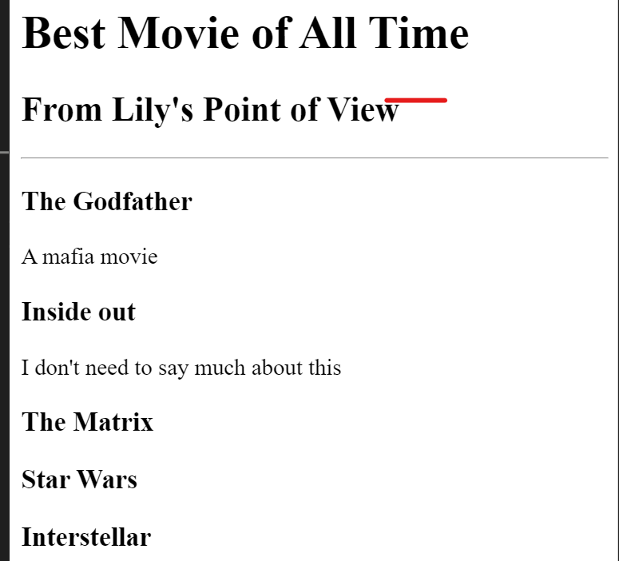

# html-portfolio
My Portfolio
<!DOCTYPE html>
<html lang="eng">
<head>
<meta charset="UTF-8">
<title>My Website</title>
</head>
<body>
   <h1>Lily's  Portfolio</h1> 
   <h2>Hello!!</h2>
      <h2>I am a web Developer</h2>
      

      
      <h4><a href="./public/birthday-invite.html">Birthday Invite</a></h4>
      
      <h4><a href=./public/movie-ranking.html> Movie Ranking</a></h4>
      <h4><a href=./public/about.html> About me</a></h4>
      <h4><a href=./public/contact.html>Contact Me</a></h4>
</body>

</html>
